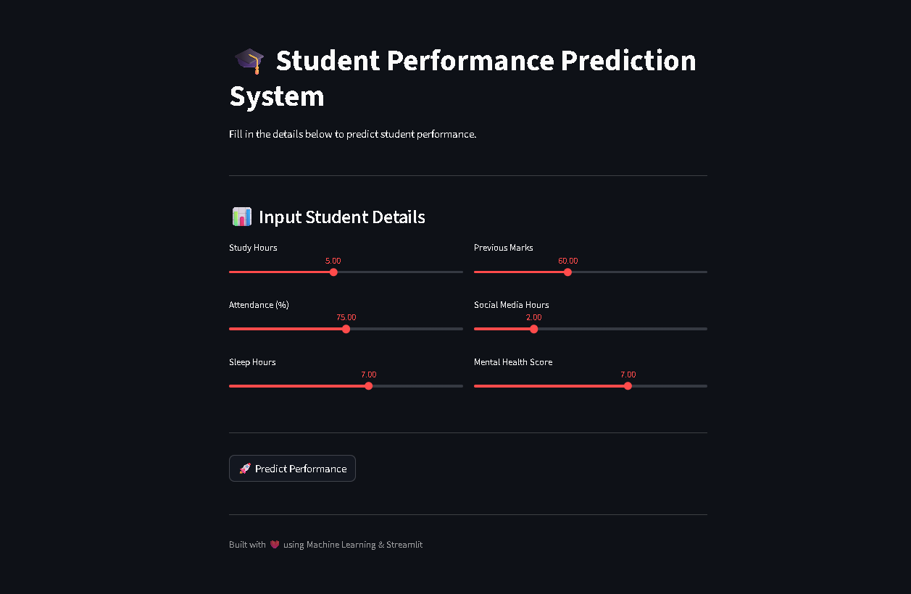
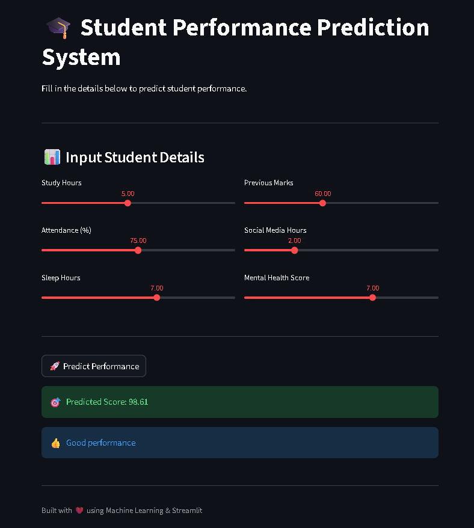
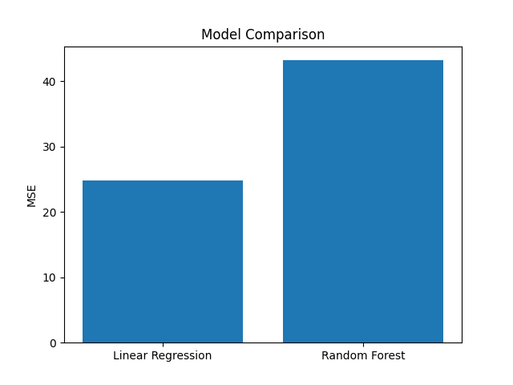
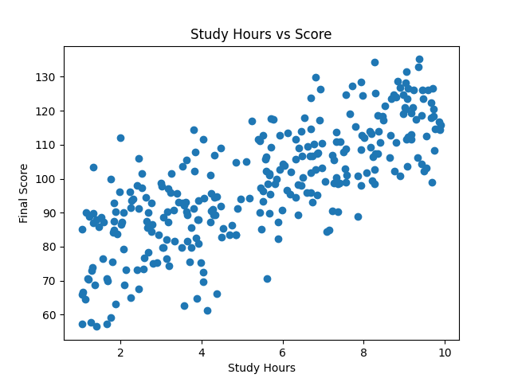

# 🎓 Student Performance Prediction System

🚀 **Live Demo:**
👉 https://student-performance-prediction-ausqqqytng7mgevjouczkq.streamlit.app/

📂 **GitHub Repository:**
👉 https://github.com/Vayu-143/Student-Performance-Prediction

---

## 📌 Overview

The **Student Performance Prediction System** is an end-to-end Machine Learning project that predicts a student's final score based on academic and behavioral factors.

This project demonstrates:

* Data generation (synthetic dataset)
* Data preprocessing
* Model training & evaluation
* Model deployment using Streamlit

---

## 🎯 Problem Statement

Educational institutions often struggle to identify students who may need additional support.

This system helps by:

* Predicting student performance
* Identifying weak students early
* Supporting data-driven decision-making

---

## 🧠 Features

✅ Predict student performance in real-time
✅ Interactive web application (Streamlit)
✅ Automatic model training if model not found
✅ Synthetic dataset generation
✅ Clean UI & user-friendly experience
✅ Deployment on cloud

---

## 🖥️ Web App Preview

### 🔹 Home Page



### 🔹 Prediction Result



---

## 📊 Data & Features

The model uses the following features:

* Study Hours
* Attendance (%)
* Previous Marks
* Sleep Hours
* Social Media Usage
* Mental Health Score

---

## 🤖 Machine Learning Model

* Model Used: **Linear Regression**
* Evaluation Metric: **Mean Squared Error (MSE)**
* Data Split: 80% Training / 20% Testing

---

## 📈 Visualizations

### 🔹 Model Comparison


### 🔹 Scatter Plot


---

## 📂 Project Structure

```
Student-Performance-Prediction/
│
├── data/
│   └── student_data.csv
│
├── images/
│   ├── app_home.png
│   ├── prediction.png
│   ├── graphs.png
│   └── folder_structure.png
│
├── models/
│   └── best_model.pkl
│
├── notebooks/
│
├── outputs/
│   ├── model_comparison.png
│   └── scatter_plot.png
│
├── src/
│   ├── data_generator.py
│   ├── train.py
│   ├── predict.py
│   └── visualize.py
│
├── app.py
├── main.py
├── requirements.txt
└── README.md
```

---

## ⚙️ Installation & Setup

### 1️⃣ Clone Repository

```bash
git clone https://github.com/Vayu-143/Student-Performance-Prediction.git
cd Student-Performance-Prediction
```

### 2️⃣ Create Virtual Environment

```bash
python -m venv .venv
```

### 3️⃣ Activate Environment (Windows)

```bash
.venv\Scripts\activate
```

### 4️⃣ Install Dependencies

```bash
pip install -r requirements.txt
```

---

## ▶️ Run the Project

### Run ML Pipeline

```bash
python main.py
```

### Run Web App

```bash
streamlit run app.py
```

---

## 🌐 Deployment

This project is deployed using **Streamlit Cloud** for real-time predictions.

---

## 🧪 How It Works

1. Generate synthetic student data
2. Train ML model
3. Save model (`.pkl`)
4. Load model in Streamlit app
5. Take user input
6. Predict student performance

---

## 🚀 Future Improvements

* Add classification (Pass/Fail)
* Use real-world dataset
* Add feature importance visualization
* Deploy using FastAPI backend
* Build teacher dashboard

---

## 👨‍💻 Author

**Vayunandan Mishra**

---

## 💡 Tech Stack

* Python
* Pandas
* NumPy
* Scikit-learn
* Streamlit

---

## ❤️ Acknowledgment

This project is built for learning, portfolio, and real-world ML application demonstration.

---

⭐ If you like this project, give it a star!
